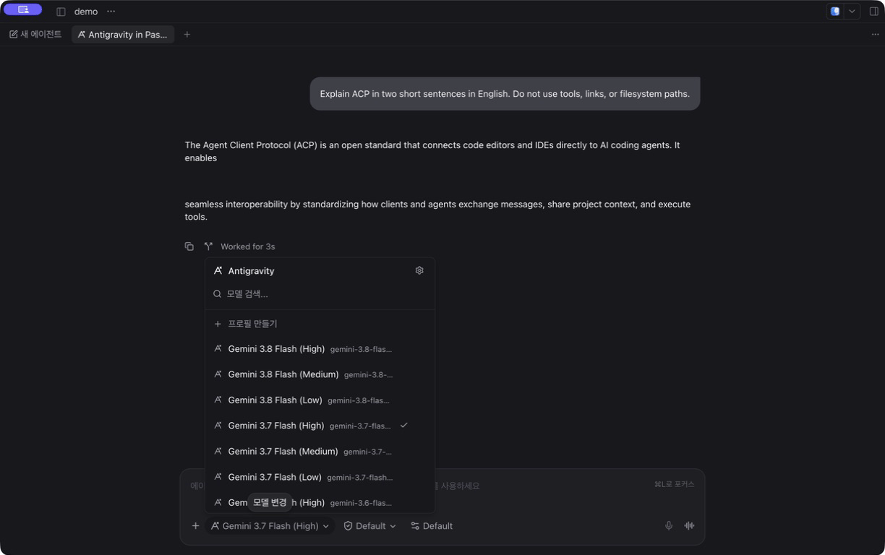

# agy-provider

Use Google's official **Antigravity ACP server** in [Paseo](https://paseo.sh/docs/plugins/providers) **0.8 and 0.9**, including the 0.9 beta. This is a community-maintained plugin. Real-agent verification covers 0.8.0; 0.9.0-beta.1 has passed SDK type and automated compatibility checks, with live sessions still unverified.

> [!IMPORTANT]
> **Paseo's injected system prompts and the instructions they contain are not applied.**
> Official ACP server 1.1.1 ignores these instructions. Workflows that rely on them are unsupported by this plugin. Review this limitation before installing.

**Known issue in Paseo 0.8.0:** streamed replies can appear as separate blocks with large gaps, splitting words, lists, and Markdown formatting ([paseo#4699](https://github.com/getpaseo/paseo/issues/4699)). **Paseo 0.9.0-beta.1 includes the upstream ACP fix** ([#4701](https://github.com/getpaseo/paseo/pull/4701)); the original Antigravity session has not been reverified. The fix comes from the daemon's ACP runtime; updating this plugin alone does not fix a 0.8.0 daemon.



Captured model picker and conversation in Paseo 0.8.0. [Desktop](images/conversation.jpg) · [Compact layout](images/compact.jpg)

## Installation

### 1. Install the official server

On the **Paseo daemon host**, download your platform's archive from the [official ACP Registry](https://github.com/agentclientprotocol/registry/blob/main/antigravity-acp/agent.json). Extract the entire archive, keeping the companion `localharness_external` executable beside the server. The ordinary `agy` CLI does not replace this server.

| Platform | Executable | Plugin-supplied arguments |
| --- | --- | --- |
| macOS ARM64 | `agy_acp_server.par` | None |
| Linux x64 / ARM64 | `agy_acp_server.par` | `--uid=` |
| Windows x64 / ARM64 | `agy_acp_server.exe` | None |

Add the extraction directory to the daemon's PATH, or set `PASEO_AGY_ACP_BIN` to the executable's absolute path. For example:

```sh
export PASEO_AGY_ACP_BIN="$HOME/.local/share/antigravity-acp/agy_acp_server.par"
```

Set this in the environment that starts the daemon; exporting it in another terminal does not change a running daemon. Restart the daemon after changing its environment. The login terminal also needs **Node.js 22.18+** and the same server configuration.

### 2. Install the plugin

```sh
paseo plugin add 3ae3ae/paseo-plugin-agy-provider
```

For an existing installation, run `paseo plugin update agy-provider`. Both the client and daemon must use Paseo 0.8 or 0.9 and a plugin revision with the matching version requirement. The login menu requires plugin v0.1.1+; older revisions restricted to 0.8 must be updated for 0.9.

### 3. Log in

1. Open a workspace in Paseo.
2. Open the **Command Center** (`Cmd+K` on macOS) and choose **Antigravity: Log in with Google**.
3. Complete Google's browser sign-in. The **Antigravity login** workspace terminal shows progress and the result; use its sign-in link if the browser does not open.
4. If the model list still shows an earlier authentication error, reload `agy-provider` in Settings → Plugins.

**No separate clone or npm install is needed.** The action uses the helper already included in the installed plugin.

The official server owns authentication and credential storage. Existing ACP authentication can be reused; ordinary `agy` CLI login alone is insufficient. If you override `GEMINI_HOME`, use the same value for the daemon and login terminal.

### Gemini API key instead of Google sign-in

Set `GEMINI_API_KEY` securely in the daemon's launch environment. Merge this into `~/.gemini/antigravity-acp/settings.json`, preserving other settings:

```json
{
  "auth": { "type": "gemini-api-key" }
}
```

Use the corresponding path under `GEMINI_HOME` if overridden, and restart the daemon to load the environment. Both the key and `auth.type` are required. This route needs no browser or login-helper invocation. See [Google's authentication options](https://antigravity.google/docs/ide/extensions/zed).

## Usage

Choose **Antigravity** in the model picker, or run:

```sh
paseo run --provider agy "Explain this project's entry point."
```

Models and modes come from the official server and your account.

```sh
paseo plugin update agy-provider
paseo plugin reload agy-provider
paseo plugin remove agy-provider
```

Update the official server separately. Removing the plugin leaves Google's server, credentials, and conversations intact.

- **Paseo 0.8:** release-pinned installations do not track updates; remove and re-add with a newer `--ref` to change the pin.
- **Paseo 0.9:** `plugin update` previews the proposed revision and asks for confirmation. Add `--check` to preview only or `--yes` to approve without a prompt. Git updates target the default branch HEAD regardless of the initial `--ref`; that selector is not a persistent pin. To select a specific tag or commit, run `paseo plugin update agy-provider --ref <tag-or-commit>` (applies without another confirmation). See the [update reference](https://paseo.sh/docs/plugins/reference#cli-reference).

## Limitations

- Real-agent verification covers macOS ARM64 and personal Google OAuth. Linux/Windows sessions, API-key and enterprise authentication, and physical mobile devices are unverified.
- In-place steering and structured output guarantees are not implemented.
- The current server/shim can display duplicate tool rows.
- The login action requires an open workspace and the default plugin ID `agy-provider`. For a remote daemon, authentication runs on that host; the helper does not relay OAuth callbacks to another machine.

See [VERIFICATION.md](VERIFICATION.md) for tested behavior and versions.

## Troubleshooting

| Symptom | Check |
| --- | --- |
| Executable not found | Daemon PATH or `PASEO_AGY_ACP_BIN`. |
| `Internal error` opening a session | Keep the companion executable beside the server; extract the full archive. |
| `Authentication required` | Use the login action, or check API-key configuration. |
| Login menu missing | Update the plugin, use a Paseo 0.8 or 0.9 client, and open a workspace. |
| Plugin rejected on Paseo 0.9 | Update to a plugin revision whose manifest allows both 0.8 and 0.9; check the client and daemon versions. |
| No models after login | Reload the plugin; check `paseo provider diagnostic agy`. |

Plugin startup logs: `paseo plugin logs agy-provider`. Remove credentials, OAuth links, and private content before sharing logs.

## Development

```sh
npm ci
npm run typecheck
npm test
paseo plugin install /absolute/path/to/paseo-plugin-agy-provider
```

The provider uses `runAcpProvider()`; the login action reuses Paseo's terminal. There are no plugin runtime dependencies or build steps. The development SDK stays at 0.8.0 to check the oldest supported API; Paseo supplies the runtime SDK. Keep the manifest compatible with 0.8: its strict schema rejects the `description` field introduced in 0.9.

[Contributing](CONTRIBUTING.md) · [Code of Conduct](CODE_OF_CONDUCT.md) · [Security reports](SECURITY.md)

## License

[MIT](LICENSE) covers this repository's code. Google's proprietary server is installed separately under [Google's terms](https://antigravity.google/terms).
